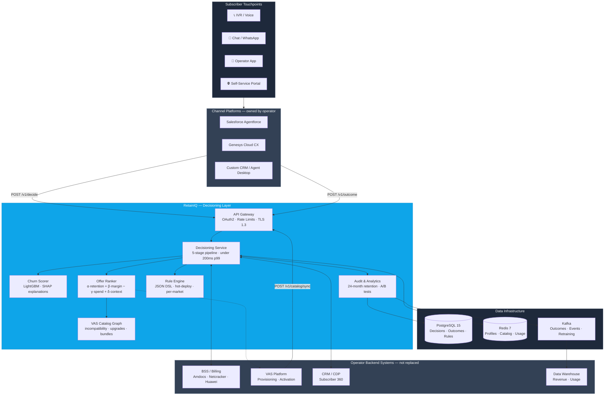
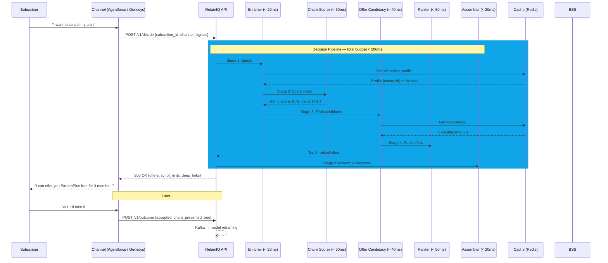
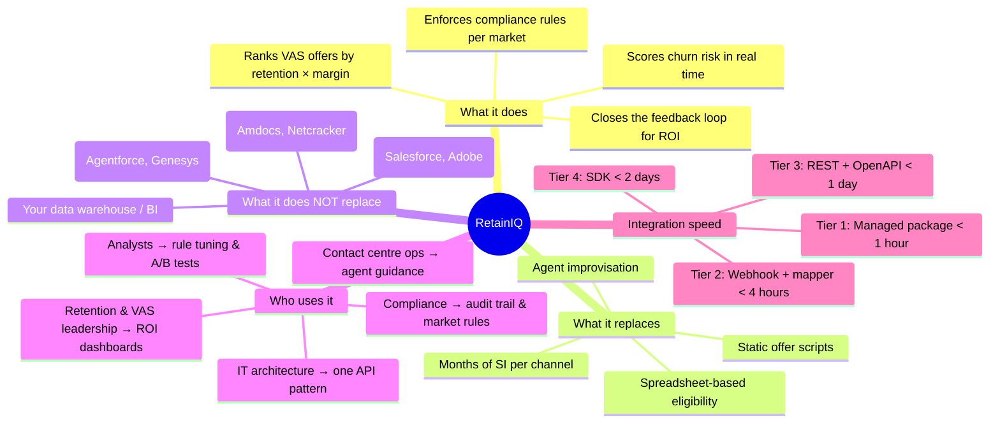

# RetainIQ

**Real-time VAS offer decisioning for telecom operators.** RetainIQ is a thin, stateless decisioning layer that sits between customer-facing channels (Agentforce, Genesys, operator apps) and BSS/VAS backends. It returns ranked, margin-aware, compliance-checked retention offers in a single low-latency API call—without replacing your conversational AI or billing stack.

| | |
|---|---|
| **Document** | Technical source: `docs/RetainIQ_Technical_Design.docx` (v1.0.0, draft) |
| **Status** | Running locally — all systems operational |
| **Stack** | Kotlin · Spring Boot WebFlux · PostgreSQL · Redis · Kafka · LightGBM · AWS me-south-1 |

## What RetainIQ Does — Animated

<p align="center">

</p>

## ROI Impact for Telcos

<p align="center">

</p>

## Important URLs

| URL | What | Credentials |
|-----|------|-------------|
| http://localhost:8080/health | API health check | — |
| http://localhost:8080/v1/decide | Decision API | JWT (see quickstart) |
| http://localhost:8080/swagger-ui.html | Swagger UI (API docs) | — |
| http://localhost:8080/v3/api-docs | OpenAPI JSON spec | — |
| http://localhost:5173 | **Management Console** (React) | admin@retainiq.com / admin123 |
| http://localhost:3000 | Grafana (dashboards) | admin / admin |
| http://localhost:9090 | Prometheus (metrics) | — |
| http://localhost:8080/actuator/prometheus | App metrics endpoint | — |

### Management Console Pages

| Page | URL | Purpose |
|------|-----|---------|
| Login | http://localhost:5173/login | Admin authentication |
| Dashboard | http://localhost:5173/ | Platform KPIs, channel distribution, top offers |
| Telco Config | http://localhost:5173/tenants | **Configure telecom operators** — BSS connection, compliance, ranking weights, API credentials |
| User Management | http://localhost:5173/users | Create/manage admin, analyst, viewer users |

### Management API Endpoints

| Method | Endpoint | Purpose |
|--------|----------|---------|
| POST | `/v1/manage/login` | Admin login (email/password) |
| GET | `/v1/manage/tenants` | List all configured telcos |
| POST | `/v1/manage/tenants` | Onboard a new telco |
| GET | `/v1/manage/tenants/:id` | Get telco config |
| PUT | `/v1/manage/tenants/:id` | Update telco config (BSS, compliance, ranking) |
| POST | `/v1/manage/tenants/:id/activate` | Activate a telco |
| POST | `/v1/manage/tenants/:id/suspend` | Suspend a telco |
| POST | `/v1/manage/tenants/:id/test-bss` | Test BSS connectivity |
| POST | `/v1/manage/tenants/:id/regenerate-credentials` | Rotate API credentials |
| GET | `/v1/manage/users` | List users |
| POST | `/v1/manage/users` | Create a user |
| PUT | `/v1/manage/users/:id` | Update user role/status |
| DELETE | `/v1/manage/users/:id` | Delete a user |
| GET | `/v1/manage/dashboard/stats` | Platform dashboard statistics |

### Default Accounts

| Email | Password | Role | Access |
|-------|----------|------|--------|
| admin@retainiq.com | admin123 | SUPER_ADMIN | Full platform access |
| admin@demo-operator.com | demo123 | TENANT_ADMIN | Demo Operator tenant only |

## Where RetainIQ Fits in the Telco Stack



## How a Decision Flows (Real-Time Path)



## The Product in One Picture



## Documentation

| Doc | Purpose |
|-----|---------|
| [quickstart.md](docs/quickstart.md) | **Start here** — integrate in under 10 minutes with code samples |
| [product.md](docs/product.md) | Product vision, personas, outcomes, and roadmap narrative (product-owner lens) |
| [architecture.md](docs/architecture.md) | System design: context, components, data, security, deployment |
| [integration.md](docs/integration.md) | One-click connectors, APIs, BSS adapters, and channel integration |
| [plan.md](docs/plan.md) | Phased implementation roadmap and exit criteria |
| [openapi.yaml](docs/openapi.yaml) | OpenAPI 3.1 spec — full schemas, error codes, examples |
| [ml-design.md](docs/ml-design.md) | ML pipeline: feature store, training, inference, A/B testing |
| [multi-tenant-design.md](docs/multi-tenant-design.md) | Schema-per-tenant DDL, provisioning, migrations, Redis namespacing |
| [mena-compliance.md](docs/mena-compliance.md) | TDRA/NCA rules, Arabic disclosures, data residency, JSON DSL examples |
| [adr/001-stack.md](docs/adr/001-stack.md) | ADR: Kotlin, AWS me-south-1, LightGBM, PostgreSQL+Redis |

## What RetainIQ Is (and Is Not)

- **Is:** A decisioning engine—churn scoring, eligibility, ranking, audit, and outcomes feedback.
- **Is not:** A conversational AI/NLU platform, a BSS, or a full analytics/BI product (it exposes APIs and embedded analytics, not a generic BI suite).

## Core API

- `POST /v1/decide` — primary real-time decision (target **under 200 ms p99** end-to-end).
- `POST /v1/outcome` — accept/decline feedback for attribution and model improvement.
- `POST /v1/catalog/sync` — VAS catalog push from the operator platform (HMAC-signed).

## Non-Functional Targets (from design)

| Area | Target |
|------|--------|
| Latency | Under 200 ms p99 |
| Availability | 99.95% monthly |
| Throughput | 5,000 RPS burst, 1,000 RPS sustained |
| Data residency | In-country UAE/KSA where required (TDRA / NCA) |
| Audit | 24 months decision retention |

## Quick Start (Developer)

```bash
# 1. Start everything
make docker-up

# 2. Get a token
curl -s -X POST http://localhost:8080/v1/auth/token \
  -H "Content-Type: application/json" \
  -d '{"grant_type":"client_credentials","client_id":"00000000-0000-0000-0000-000000000001","client_secret":"demo"}'

# 3. Make a decision
curl -s -X POST http://localhost:8080/v1/decide \
  -H "Authorization: Bearer $TOKEN" \
  -H "X-Tenant-ID: 00000000-0000-0000-0000-000000000001" \
  -H "Content-Type: application/json" \
  -d '{"subscriber_id":"sub_123","channel":"app","signals":{"intent":"cancel","frustration_score":0.8}}'
```

See [quickstart.md](docs/quickstart.md) for full integration guide with code samples in Python, Node, Java, and Apex.

## Repository Layout

```
retainiq/
├── README.md
├── build.gradle.kts                     # Kotlin/Spring Boot 3 + WebFlux
├── Dockerfile                           # Multi-stage, Temurin 21, ZGC
├── docker-compose.yml                   # Full local stack (PG + Redis + Kafka)
├── Makefile                             # build, test, run, curl-* helpers
├── k8s/base/                            # Kubernetes manifests (deploy, HPA, ingress)
├── src/main/kotlin/com/retainiq/
│   ├── RetainIQApplication.kt
│   ├── api/                             # Controllers (decide, outcome, catalog, auth)
│   ├── service/                         # DecisionService, repositories, catalog, tenants
│   │   └── pipeline/                    # 5-stage pipeline (enrich → score → candidacy → rank → assemble)
│   ├── cache/                           # Redis cache (subscriber profiles, VAS catalog)
│   ├── security/                        # JWT auth, SecurityConfig, token service
│   ├── config/                          # Redis, Jackson configuration
│   ├── domain/                          # Domain models (Tenant, Subscriber, VasProduct, Decision)
│   └── exception/                       # Custom exceptions + global error handler
├── src/main/resources/
│   ├── application.yml                  # Config with profiles (local, prod)
│   └── db/migration/platform/           # Flyway migrations (partitioned tables)
├── src/test/kotlin/                     # Unit + integration tests
└── docs/
    ├── RetainIQ_Technical_Design.docx   # authoritative technical design (ingested)
    ├── quickstart.md                    # developer quick start (10 min)
    ├── product.md                       # product vision & personas
    ├── architecture.md                  # system design & components
    ├── integration.md                   # connectors, APIs, BSS adapters
    ├── plan.md                          # phased roadmap & exit criteria
    ├── openapi.yaml                     # OpenAPI 3.1 spec
    ├── ml-design.md                     # ML pipeline LLD
    ├── multi-tenant-design.md           # schema isolation & provisioning
    ├── mena-compliance.md               # TDRA/NCA regulatory design
    └── adr/
        └── 001-stack.md                 # tech stack decision record
```

## Confidentiality

Design materials may be marked confidential. Do not distribute outside authorised stakeholders.

---

*Generated from RetainIQ Technical Design Documentation (April 2026).*
