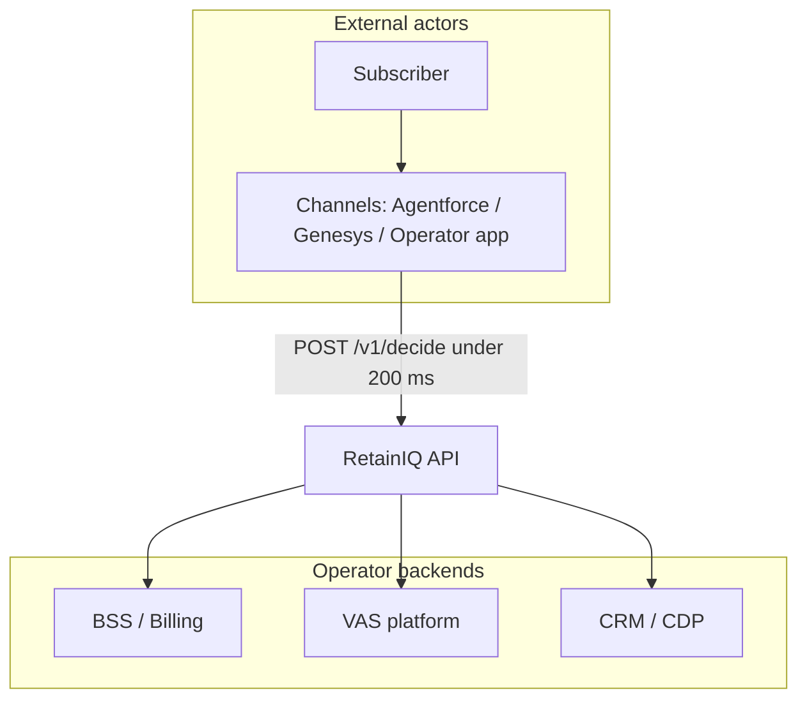
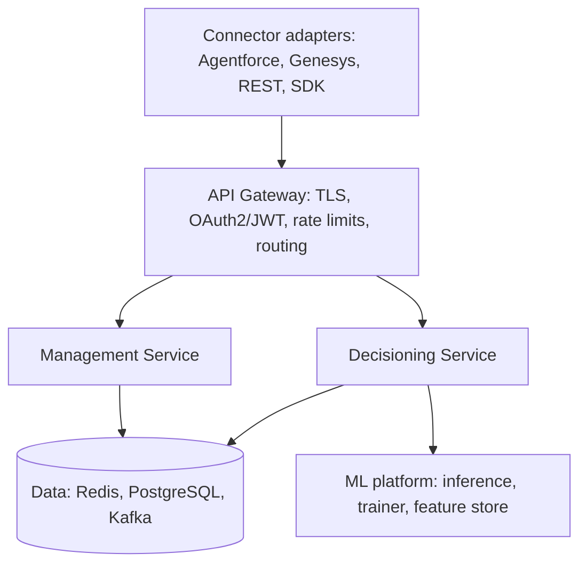

# RetainIQ — Architecture

This document summarises the system design from the RetainIQ Technical Design (SDD/HLD/LDD): context, boundaries, key decisions, component layout, data models, security, caching, deployment, and observability.

## 1. System context

RetainIQ sits in the **decisioning layer** between operator channels and BSS/VAS/CRM systems. It does **not** replace conversational AI or billing; it tells those systems **what to offer**, with compliance and margin awareness.

### Context (SVG)

<svg xmlns="http://www.w3.org/2000/svg" viewBox="0 0 720 280" width="100%" role="img" aria-label="RetainIQ between channels and backends">
  <defs>
    <linearGradient id="bg" x1="0" y1="0" x2="1" y2="1">
      <stop offset="0%" stop-color="#0f172a"/>
      <stop offset="100%" stop-color="#1e293b"/>
    </linearGradient>
  </defs>
  <rect width="720" height="280" fill="url(#bg)" rx="8"/>
  <rect x="24" y="40" width="140" height="48" fill="#334155" stroke="#94a3b8" rx="4"/>
  <text x="94" y="70" text-anchor="middle" fill="#f8fafc" font-family="system-ui,sans-serif" font-size="13">Subscriber</text>
  <rect x="200" y="32" width="200" height="64" fill="#1d4ed8" stroke="#93c5fd" rx="4"/>
  <text x="300" y="60" text-anchor="middle" fill="#f8fafc" font-family="system-ui,sans-serif" font-size="13">Channels</text>
  <text x="300" y="80" text-anchor="middle" fill="#cbd5e1" font-family="system-ui,sans-serif" font-size="11">IVR, chat, agent desktop</text>
  <rect x="452" y="40" width="160" height="48" fill="#0ea5e9" stroke="#7dd3fc" rx="4"/>
  <text x="532" y="70" text-anchor="middle" fill="#0f172a" font-family="system-ui,sans-serif" font-size="14" font-weight="600">RetainIQ</text>
  <rect x="120" y="160" width="140" height="44" fill="#334155" stroke="#94a3b8" rx="4"/>
  <text x="190" y="187" text-anchor="middle" fill="#e2e8f0" font-family="system-ui,sans-serif" font-size="12">BSS / Billing</text>
  <rect x="290" y="160" width="140" height="44" fill="#334155" stroke="#94a3b8" rx="4"/>
  <text x="360" y="187" text-anchor="middle" fill="#e2e8f0" font-family="system-ui,sans-serif" font-size="12">VAS platform</text>
  <rect x="460" y="160" width="140" height="44" fill="#334155" stroke="#94a3b8" rx="4"/>
  <text x="530" y="187" text-anchor="middle" fill="#e2e8f0" font-family="system-ui,sans-serif" font-size="12">CRM / CDP</text>
  <path d="M 300 96 L 532 96 L 532 160" fill="none" stroke="#38bdf8" stroke-width="2"/>
  <text x="420" y="112" text-anchor="middle" fill="#7dd3fc" font-family="system-ui,sans-serif" font-size="11">Decide API</text>
  <path d="M 532 88 L 532 40" fill="none" stroke="#94a3b8" stroke-width="1.5" stroke-dasharray="4 3"/>
  <path d="M 532 204 L 532 240 L 360 240 L 360 204" fill="none" stroke="#64748b" stroke-width="1.5"/>
  <path d="M 532 240 L 190 240 L 190 204" fill="none" stroke="#64748b" stroke-width="1.5"/>
  <path d="M 532 240 L 530 240" fill="none" stroke="#64748b" stroke-width="1.5"/>
</svg>

## 2. Scope boundaries

| Capability | In scope | Out of scope |
|------------|----------|----------------|
| Offer decisioning | Core product | — |
| VAS catalog | Sync + model (read) | Catalog authoring / pricing tools |
| Conversational AI | Signal ingestion only | Full NLU / dialogue |
| BSS | Trigger via webhook | BSS configuration |
| Identity | Subscriber ID in request | MSISDN auth flows |
| Payments | Payment link in offer | Payment processing |
| Analytics | API + embedded dashboards | Full BI platform |

## 3. Key design decisions

### 3.1 Stateless API-first core

All subscriber state is loaded **per request** from BSS/CRM (with caching). No shared session cluster—horizontal scale-out stays simple.

### 3.2 One-click integration (managed connectors)

Connectors use **OAuth 2.0 client credentials** and **automatic field mapping**; operators configure BSS in a guided UI (~15 minutes). This is the primary GTM differentiator.

### 3.3 Decision pipeline (budgeted stages)

| Stage | Budget | Responsibility |
|-------|--------|------------------|
| 1 — Signal enrichment | &lt; 20 ms | CRM/BSS cache reads; decode channel signals |
| 2 — Churn scoring | &lt; 30 ms | GBT; `churn_score`, `top_risk_factors` |
| 3 — Offer candidacy | &lt; 40 ms | Catalog graph; eligibility + regulatory rules |
| 4 — Offer ranking | &lt; 50 ms | Multi-objective score; budget; A/B variant |
| 5 — Response assembly | &lt; 20 ms | Scripts, async audit write, JSON response |

### 3.4 Caching

| Data | Cache | TTL | Invalidation |
|------|-------|-----|----------------|
| VAS catalog | Redis cluster | 15 min | Webhook from VAS platform |
| Subscriber profile | Redis per tenant | 5 min | BSS event stream |
| Usage | Redis per tenant | 1 min | Time-based |
| Churn model | In-process (JVM) | 24 h | Model deploy event |
| Eligibility rules | Redis cluster | 1 h | Rule engine publish |

**Cache miss under load:** If a cache miss occurs during high traffic, RetainIQ does **not** fan out to the origin for every request. Behaviour per entity:

| Data | On cache miss | Consequence |
|------|--------------|-------------|
| Subscriber profile | Single async fetch + cache-aside; concurrent requests wait on the same future (request coalescing) | First request adds ~50ms; subsequent requests hit cache |
| VAS catalog | Catalog is **pre-warmed** on pod startup and refresh; a miss here means a deployment issue, not normal traffic | Alert fires; degraded mode returns generic offers |
| Usage | Fetch from BSS with 500ms timeout; on timeout, use stale value if available, else omit from scoring | Churn score slightly less accurate; `confidence=MEDIUM` |
| Churn model | Model is in-process; cannot "miss" | If model load fails on startup, pod fails readiness check |
| Eligibility rules | Fetch from PostgreSQL with 200ms timeout; cache-aside | First request slower; rules rarely change so miss rate is negligible |

## 4. Logical component architecture

Hexagonal (ports-and-adapters): **domain core** is pure; I/O via swappable adapters.

**Decisioning service** (stateless, autoscaled): signal enricher, churn scorer, offer ranker, response builder.

**Management service** (fixed footprint in design): catalog sync, rule engine, A/B framework, analytics API.

## 5. Data architecture

### 5.1 Core entities

| Entity | Store | Key attributes |
|--------|-------|----------------|
| Tenant | PostgreSQL (shared schema) | id, name, market, regulatory_profile, catalog_webhook_url |
| Subscriber | Redis (ephemeral, per tenant) | msisdn_hash, segment, tenure, ARPU, churn_score |
| VAS product | PostgreSQL + Redis | sku, margin, eligibility_rules[], markets[] |
| Decision | PostgreSQL append-only | id, tenant, subscriber_hash, offers_ranked[], signal_vector, ts |
| Outcome | PostgreSQL | decision_id, offer_sku, accepted, revenue_impact, churn_prevented |
| Rule | PostgreSQL + Redis | id, type, expression_json, market, version |
| A/B test | PostgreSQL | variants, allocation, dates, metric |

### 5.2 VAS catalog graph

Products are nodes with edges for **incompatibility**, **upgrade-from**, and **bundle-with**, plus per-market regulatory disclosure and consent flags.

## 6. Decisioning engine (summary)

### 6.1 Churn model features (illustrative weights)

| Group | Weight | Examples |
|-------|--------|----------|
| Usage | 35% | Data/voice/SMS deltas |
| Billing | 25% | Bill shock, payment delay, disputes |
| Contact | 20% | Contacts, frustration, prior churn intent |
| Lifecycle | 12% | Tenure, contract end, last upgrade |
| Competitive | 8% | Competitor mention, port inquiry |

New tenants: **base model + Bayesian adaptation** for the first ~90 days.

### 6.2 Ranking (configurable per tenant)

`score = α·retention_p + β·margin − γ·spend_cap_pressure + δ·context_match` with defaults α=0.45, β=0.30, γ=0.15, δ=0.10.

Hard filters apply **before** scoring (tenure, offer frequency caps, declined history, market).

### 6.3 Rule engine

Declarative JSON DSL, **hot-deployed** without service restart.

## 7. Security

- **M2M auth:** OAuth 2.0 client credentials; JWT scoped to tenant + permissions (e.g. 15-minute expiry).
- **Console:** OIDC SSO + RBAC (Admin / Analyst / Viewer).
- **Privacy:** MSISDN only as **HMAC-SHA256** in logs; no raw PII in decisioning logs; tenant **schema isolation** + RLS.
- **Encryption:** TLS 1.3 in transit; AES-256 at rest; **BYOK** on enterprise tier (Phase 6).

## 8. Infrastructure and deployment

**Kubernetes** namespace `retainiq-{env}`:

| Workload | Replicas | Notes |
|----------|----------|--------|
| decisioning-service | 3–20 | HPA on CPU + RPS |
| management-service | 2 | Fixed |
| connector-agentforce / genesys | 2 each | Fixed |
| connector-generic | 2–10 | HPA |
| ml-inference | 2–8 | HPA on GPU |
| catalog-sync-worker | 2 | Fixed |
| outcome-writer | 2 | Kafka consumer |

**Data stores (per region):** PostgreSQL 15 (Multi-AZ), Redis 7 cluster, Kafka 3.5.

**Regions (design):** Primary `me-central1` (UAE) or `me-south-1` (Bahrain); DR `eu-west-1` for non-PII; sovereign option for KSA (NCA).

## 9. Observability and SLO signals

| Signal | Tool | Alert threshold (design) |
|--------|------|--------------------------|
| API latency p99 | Prometheus + Grafana | &gt; 180 ms for 2 min |
| Error rate | Prometheus | &gt; 0.5% 5xx for 1 min |
| Kafka lag | Prometheus | &gt; 10k messages |
| Redis hit rate | Redis metrics | &lt; 85% |
| Model drift | Custom | AUC drop &gt; 5% vs baseline |
| Throughput | Prometheus | &lt; 80% of expected RPS |

## 10. Graceful degradation

If BSS is slow or cache misses propagate: use **JWT-scoped segment**, **stale churn** where safe, and a **pre-computed generic offer set**—response is always **usable** (`degraded=true`, `confidence=LOW`), never empty.

---

*Derived from RetainIQ Technical Design §2–6, §8–9, §11–12, §13.6.*
