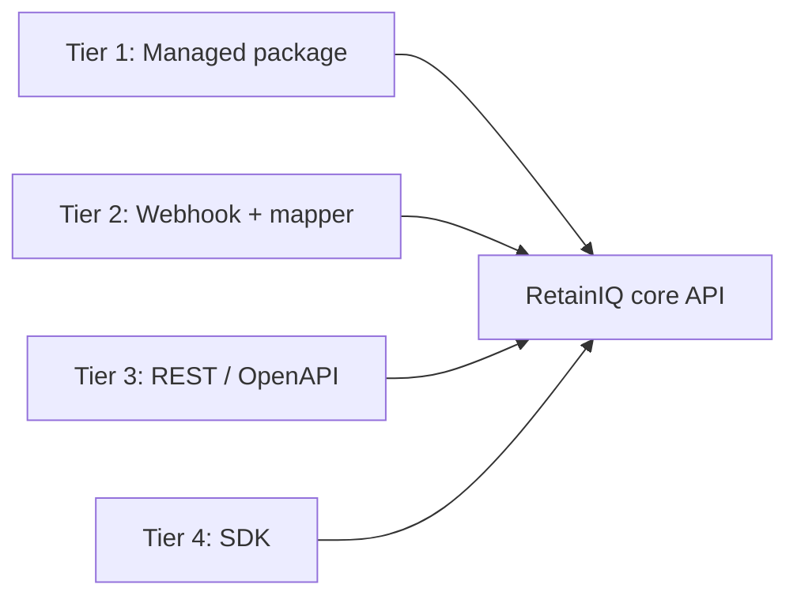
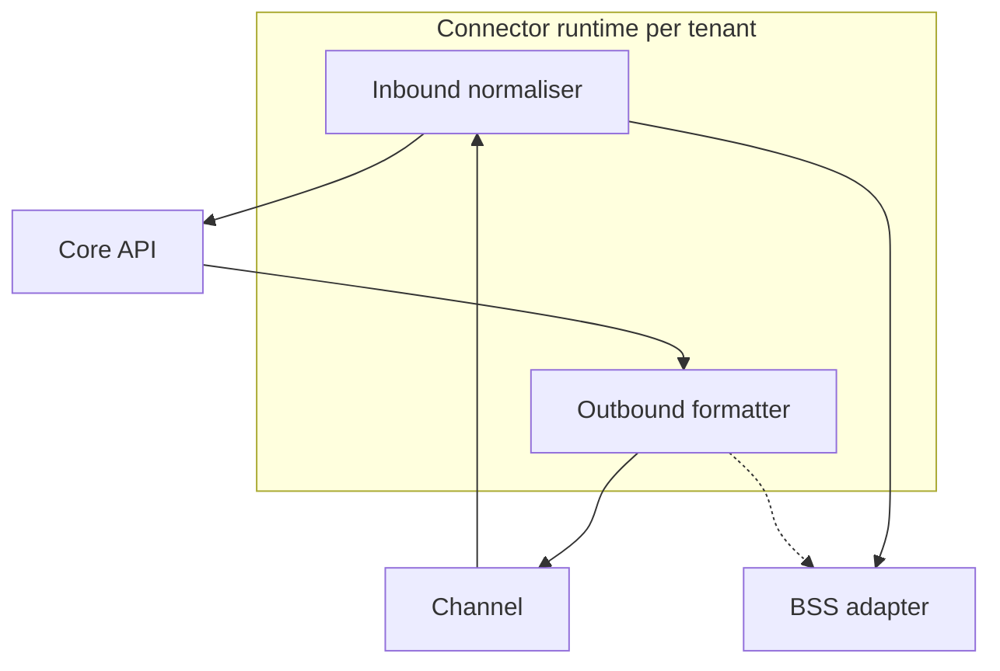
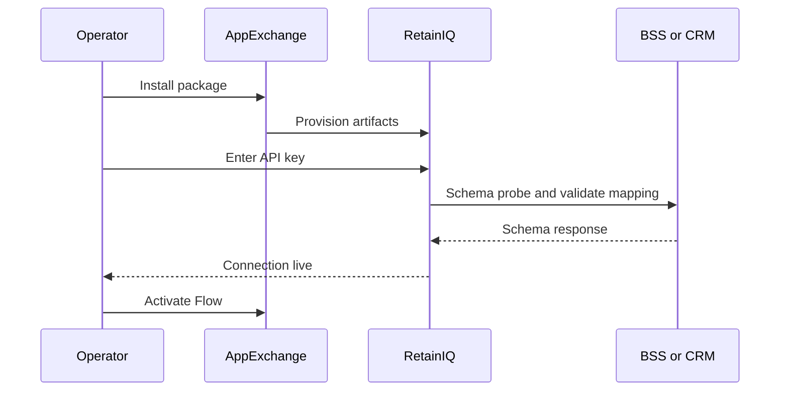
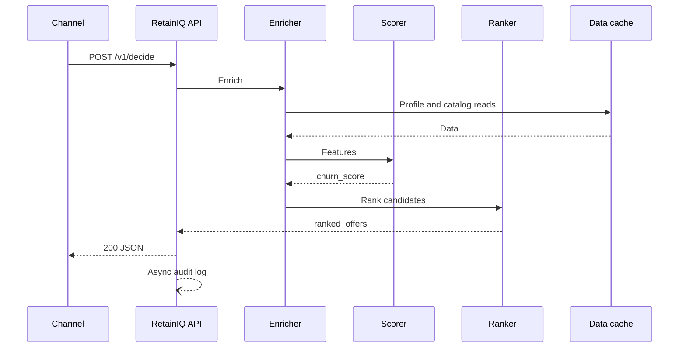

# RetainIQ — Integration Guide

This document describes how operators and channel platforms integrate with RetainIQ — the real-time execution layer for CVM (Customer Value Management). It covers **integration tiers**, **managed connectors**, **BSS adapters**, **API contracts**, and **operational flows** (including catalog sync and outcomes). RetainIQ brings CVM strategy to life at the speed of conversation.

## 1. Integration philosophy

- **Single primary call path:** `POST /v1/decide` for real-time decisions.
- **Minimal payload:** enrichment is server-side; channels send subscriber id, channel id, and optional signals.
- **No bespoke SI for the happy path:** managed packages and field mapping UIs reduce custom code.

## 2. Integration tiers

| Tier | Method | Setup time | Code | Best for |
|------|--------|------------|------|----------|
| 1 | AppExchange / AppFoundry managed package | &lt; 1 hour | None | Agentforce, Genesys |
| 2 | No-code webhook + field mapper UI | &lt; 4 hours | None | Any HTTP-capable system |
| 3 | REST + OpenAPI | &lt; 1 day | Minimal | Custom apps |
| 4 | SDK (Node.js, Python, Java) | &lt; 2 days | Standard | Embedded operator platforms |



## 3. Authentication

- **Machine-to-machine:** OAuth 2.0 **client credentials**.
- **Requests:** `Authorization: Bearer {access_token}`, `X-Tenant-ID: {tenant_id}` where required.
- **Gateway:** Tokens validated at the API gateway; decisioning receives **pre-validated** requests.

## 4. Connector runtime (conceptual)

Per-tenant runtime maps **channel payloads** ↔ **canonical `DecideRequest`**, and **RetainIQ responses** ↔ **channel-native** formats (e.g. Agentforce cards, Genesys notifications, raw JSON).



### BSS adapter (configurable)

- **Protocols:** SOAP / REST (toggle per tenant).
- **Mapping:** YAML field mapping.
- **Auth:** OAuth2, Basic, API key, mTLS.

## 5. Agentforce one-click flow (reference)

| Step | Action | Outcome |
|------|--------|---------|
| 1 | Install "RetainIQ for Agentforce" from AppExchange | Named Credential, Custom Action, Flow template provisioned |
| 2 | Enter RetainIQ API key in Setup (one field) | Connectivity test; green status within ~10 seconds |
| 3 | Activate supplied Flow in Flow Builder | Flow invokes RetainIQ on case open |
| 4 | Use agent workspace | Ranked offers with script and provisioning deep link |

**Target operator time:** under **45 minutes**, **zero custom code**.

### Setup sequence (Mermaid)



## 6. API reference (summary)

### 6.1 `POST /v1/decide`

**Headers:** `Authorization`, `Content-Type: application/json`, `X-Tenant-ID`.

**Request (abridged):**

```json
{
  "subscriber_id": "opaque-subscriber-ref",
  "channel": "agentforce|genesys|app|ivr",
  "signals": {
    "frustration_score": 0.0,
    "intent": "cancel|complaint|billing|upgrade",
    "session_duration_s": 0,
    "prior_contacts_30d": 0
  },
  "context": {
    "reason_code": "billing|network|competitor",
    "market": "AE|SA|KW|BH|OM"
  },
  "options": {
    "max_offers": 3,
    "explain": false,
    "dry_run": false
  }
}
```

**Response headers:** `X-Decision-ID`, `X-Latency-Ms`.

**Response body:** `decision_id`, subscriber summary (`segment`, `churn_score`, `churn_band`, `tenure_days`), ranked `offers[]` (sku, pricing, `retention_p`, `script_hint`, `deep_link`, regulatory block), `action`, `fallback`, `latency_ms`.

### 6.2 `POST /v1/outcome`

Closes the feedback loop for **attribution** and **retraining**.

```json
{
  "decision_id": "uuid",
  "offer_sku": "string",
  "outcome": "accepted|declined|no_response",
  "revenue_delta": 0,
  "churn_prevented": true
}
```

### 6.3 `POST /v1/catalog/sync`

Called by the **VAS platform** (push model).

**Headers:** `X-Tenant-ID`, `X-Signature: HMAC-SHA256(body, webhook_secret)`.

```json
{
  "event": "product.updated|product.created|product.retired",
  "products": [],
  "full_sync": false
}
```

Processing is asynchronous: **202 Accepted** with worker handling diffs, graph updates, and cache invalidation—**freshness target &lt; 15 minutes** from platform change.

## 7. Real-time decision sequence (in conversation)



## 8. Error handling expectations

- Under dependency failure, RetainIQ should return **degraded** responses with **generic safe offers** rather than empty results (see architecture doc).
- Clients should surface `degraded` and `confidence` to agents per UX policy.

## 9. Parallel integration strategy

If **AppExchange** or **AppFoundry** approval slips, **Tier 2 webhook** remains the non-blocking path for pilots; Tier 1 is accelerant, not a single point of failure for first revenue.

---

## 10. Management Console

The RetainIQ management console (http://localhost:5173) provides a self-service UI for telecom operator configuration:

- **Telco Config** — BSS connection details, compliance rules, ranking weights, API credentials
- **User Management** — create and manage users with RBAC roles (super_admin, tenant_admin, analyst, viewer)
- **Dashboard** — platform KPIs, channel distribution, top-performing offers

This eliminates the need for manual configuration files or database edits when onboarding or tuning a tenant.

## 11. API Exploration

Swagger UI is available at http://localhost:8080/swagger-ui.html for interactive API exploration. The full OpenAPI 3.1 spec is served at http://localhost:8080/v3/api-docs.

## 12. Integration Scalability (Load Test Results)

Load testing with k6 confirms integration scalability on a single Docker container:

- **Sequential hot path:** 6ms average latency
- **Peak throughput:** 512 RPS with 0% errors
- **50 concurrent VUs:** 87ms average (first run)

These results validate that the integration path scales for production workloads. With 3+ Kubernetes pods on dedicated infrastructure, the 200ms p99 SLA is achievable with significant headroom.

---

*Derived from RetainIQ Technical Design §5.2, §7, §10, §13.1–13.6.*
