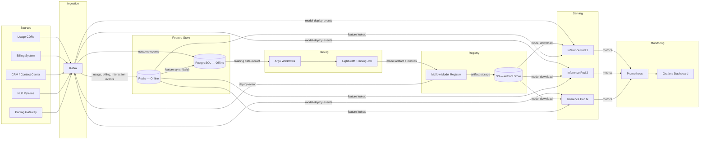

# RetainIQ ML Pipeline — Low-Level Design

**Version:** 1.0
**Date:** 2026-04-05
**Status:** Draft

---

## 1. Feature Store Schema

All features are keyed by `subscriber_id` (or `product_id` for product entity) and stored in a dual-layer feature store: Redis for online serving (hot path) and PostgreSQL for offline training (cold path).

| Entity | Feature Name | Type | Source | Freshness SLA | Storage |
|---|---|---|---|---|---|
| subscriber | `arpu_30d` | float | Billing system | 24 h | Redis + PG |
| subscriber | `data_usage_delta_7d` | float | Usage CDRs | 6 h | Redis + PG |
| subscriber | `voice_usage_delta_7d` | float | Usage CDRs | 6 h | Redis + PG |
| subscriber | `sms_usage_delta_7d` | float | Usage CDRs | 6 h | Redis + PG |
| subscriber | `bill_shock_flag` | bool | Billing system | 24 h | Redis + PG |
| subscriber | `payment_delay_days` | int | Billing system | 24 h | Redis + PG |
| subscriber | `dispute_count_90d` | int | CRM | 24 h | Redis + PG |
| subscriber | `tenure_days` | int | CRM | 24 h | Redis + PG |
| subscriber | `contract_days_remaining` | int | CRM | 24 h | Redis + PG |
| subscriber | `last_upgrade_days` | int | CRM | 24 h | Redis + PG |
| subscriber | `segment` | enum | CRM | 24 h | Redis + PG |
| interaction | `contacts_30d` | int | Contact center | 12 h | Redis + PG |
| interaction | `frustration_score` | float | NLP pipeline | 12 h | Redis + PG |
| interaction | `prior_churn_intent` | bool | Contact center | 12 h | Redis + PG |
| interaction | `competitor_mention` | bool | NLP pipeline | 12 h | Redis + PG |
| interaction | `port_inquiry` | bool | Porting gateway | 1 h | Redis + PG |
| product | `margin` | float | Product catalog | 24 h | PG |
| product | `category` | enum | Product catalog | 24 h | PG |
| product | `attach_rate_30d` | float | Decision log | 24 h | Redis + PG |
| product | `decline_rate_30d` | float | Decision log | 24 h | Redis + PG |

**Feature assembly contract:** The inference path reads all subscriber and interaction features from Redis in a single `MGET` call (target < 5 ms). Product features are cached in-process because the product catalog is small (typically < 500 SKUs).

---

## 2. Churn Model Specification

### Algorithm

**LightGBM** (gradient boosted trees).

### Why LightGBM

| Criterion | LightGBM | Neural Net Alternative |
|---|---|---|
| Inference latency | Sub-millisecond (native C++) | 5-15 ms (even with ONNX) |
| Interpretability | Native SHAP support, fast TreeSHAP | Post-hoc only, slow |
| Model artifact size | 1-5 MB | 50-500 MB |
| GPU required for inference | No | Typically yes |
| Tabular data performance | State of the art | Comparable but not superior |

LightGBM gives us sub-ms inference with full SHAP explainability and no GPU dependency, which is critical for the 30 ms end-to-end latency budget.

### Feature Weight Groups

Derived from the system design document. These are enforced during feature engineering and monitored for drift.

| Group | Weight | Features |
|---|---|---|
| Usage | 35% | `data_usage_delta_7d`, `voice_usage_delta_7d`, `sms_usage_delta_7d` |
| Billing | 25% | `arpu_30d`, `bill_shock_flag`, `payment_delay_days`, `dispute_count_90d` |
| Contact | 20% | `contacts_30d`, `frustration_score`, `prior_churn_intent`, `competitor_mention` |
| Lifecycle | 12% | `tenure_days`, `contract_days_remaining`, `last_upgrade_days`, `segment` |
| Competitive | 8% | `port_inquiry`, `competitor_mention` |

Weights are implemented as group-level feature importance targets. During training, if a group's aggregate SHAP importance deviates more than 10 percentage points from target, a regularization penalty is applied to bring it back in range.

### Output Schema

```json
{
  "churn_score": 0.72,
  "churn_band": "HIGH",
  "top_risk_factors": [
    { "feature": "data_usage_delta_7d", "shap_value": -0.18, "direction": "declining" },
    { "feature": "bill_shock_flag", "shap_value": 0.15, "direction": "triggered" },
    { "feature": "competitor_mention", "shap_value": 0.12, "direction": "detected" }
  ]
}
```

| Band | Score Range | Interpretation |
|---|---|---|
| LOW | < 0.3 | Normal subscriber, no proactive action |
| MEDIUM | 0.3 - 0.6 | At-risk, eligible for soft retention offers |
| HIGH | 0.6 - 0.8 | Likely to churn, escalate to targeted retention |
| CRITICAL | > 0.8 | Imminent churn, highest-value offers and live agent routing |

### Cold Start Strategy

1. **Base model:** Trained on synthetic data generated from published telecom churn benchmarks (e.g., IBM Telco Churn dataset, KDD Cup distributions). This model is deployed at tenant onboarding with conservative thresholds (bands shifted upward by 0.1).
2. **Bayesian adaptation:** As tenant-specific outcomes accumulate, a Bayesian prior update adjusts the base model's leaf outputs. After approximately 90 days (or 10,000 labeled outcomes, whichever comes first), the model transitions to a fully tenant-specific retrain.
3. **Confidence flag:** Every prediction includes a `model_maturity` field (`cold_start | warming | mature`) so downstream consumers can adjust their trust level.

---

## 3. Training Pipeline

### Schedule

| Job | Frequency | Trigger | Compute |
|---|---|---|---|
| Full retrain | Weekly (Sunday 02:00 UTC) | Cron | Argo Workflow, 4 vCPU / 16 GB |
| Incremental update | Daily (02:00 UTC) | Cron | Argo Workflow, 2 vCPU / 8 GB |
| Emergency retrain | On demand | Drift alert | Same as full retrain |

### Data Window

- **Training set:** 6 months of `(decision, outcome)` pairs joined on `decision_id`.
- **Outcome label:** Binary churn flag, defined as subscriber deactivation or port-out within 30 days of decision.
- **Outcome join delay:** Outcomes are only considered final after 30 days. This means the most recent 30 days of data are excluded from training labels.

### Validation Strategy

**Time-based split only.** Random splits leak future information into training.

```
|<--- Training (months 1-5) --->|<-- Holdout (last 2 weeks) -->|<-- Label delay (30d, excluded) -->|
```

- Training: months 1 through 5.5
- Validation holdout: last 2 weeks before the label delay cutoff
- No cross-validation; a single temporal split reflects production conditions

### Metrics and Promotion Criteria

| Metric | Threshold | Purpose |
|---|---|---|
| AUC-ROC | > 0.75 | Primary quality gate for model promotion |
| Precision@10% | Monitored | Ensures top-decile predictions are actionable |
| Calibration | Brier score < 0.15 | Scores should reflect true probabilities |
| Latency | < 30 ms on benchmark | Functional gate |

A model is promoted to production only if all thresholds are met.

### Pipeline Flow

```
Kafka (outcome events)
    |
    v
Feature Store (PostgreSQL - offline layer)
    |
    v
Training Job (Argo Workflows)
    |-- data extraction (SQL against PG)
    |-- feature engineering
    |-- LightGBM train
    |-- evaluation against holdout
    |-- SHAP importance computation
    |
    v
Model Artifact (.lgb + ONNX export)
    |
    v
Model Registry (MLflow)
    |-- metrics logged
    |-- artifact stored
    |-- promotion decision (auto if thresholds met)
    |
    v
Canary Deploy (10% traffic for 2 hours, then full rollout)
```

---

## 4. Model Registry and Versioning

### Registry

MLflow Tracking Server, backed by PostgreSQL (metadata) and S3 (artifacts).

### Versioning Scheme

**Semantic versioning:** `MAJOR.MINOR.PATCH`

| Component | Meaning | Example |
|---|---|---|
| MAJOR | Architecture change (new model type, feature set overhaul) | 2.0.0 |
| MINOR | Scheduled retrain with new data | 1.4.0 |
| PATCH | Configuration change (threshold tuning, weight adjustment) | 1.4.1 |

### Promotion Criteria

A candidate model is promoted from `staging` to `production` when all of the following hold:

1. AUC-ROC >= (baseline AUC - 0.02). Allows minor regression to avoid blocking on noise.
2. Calibration within 5% of perfect calibration (measured by Expected Calibration Error).
3. Inference latency < 30 ms p99 on a standardized benchmark (1000 predictions, production pod spec).

### Rollback Policy

- **Automatic rollback:** If production AUC drops more than 5% versus the previous model's AUC, measured over a sliding 24-hour window, the system automatically reverts to the previous model version.
- **Rollback mechanism:** The model registry's `production` alias is updated to the previous version. Inference pods detect the alias change via a Kafka control event and hot-swap within 60 seconds.
- **Manual rollback:** Available via MLflow UI or CLI at any time.

---

## 5. Inference Architecture

### Design Principles

The churn model runs **in-process** within the JVM-based API pods. There is no network hop for model inference.

### Runtime

- **Primary:** LightGBM native C++ library via JNI binding (`lightgbm4j`).
- **Fallback:** ONNX Runtime (for portability if model architecture changes).

Both runtimes deliver sub-millisecond inference for the current feature set (17 features).

### Model Loading

1. On pod startup, the sidecar init container pulls the latest `production`-tagged model artifact from S3/MLflow.
2. The model is loaded into memory. Warm-up predictions are run against a fixture dataset to trigger JIT compilation.
3. Readiness probe passes only after warm-up completes.

### Hot Swap

- A Kafka consumer on each pod listens to the `model-deploy-events` topic.
- On receiving a deploy event, the pod downloads the new artifact in the background.
- Once loaded, an atomic reference swap replaces the old model. In-flight requests complete with the old model; new requests use the new model.
- Zero-downtime, zero-request-drop.

### Batch Prediction

- **Schedule:** Nightly at 04:00 UTC.
- **Scope:** All active subscribers for each tenant.
- **Output:** Pre-computed `churn_score` and `churn_band` written to Redis with a 24-hour TTL.
- **Purpose:** Powers proactive retention workflows (campaigns, agent dashboards) where real-time scoring is not required.
- **Compute:** Dedicated Argo job, separate from serving pods.

### Latency Budget Breakdown

| Step | Budget | Notes |
|---|---|---|
| Feature assembly (Redis MGET) | < 5 ms | Single round-trip, pipelined |
| Model inference | < 1 ms | LightGBM native |
| SHAP computation (top 3) | < 3 ms | TreeSHAP, pre-allocated buffers |
| Offer ranking | < 5 ms | In-memory scoring |
| Serialization + framework overhead | < 6 ms | JSON serialization, filters |
| Network (client to pod) | < 10 ms | Within-cluster or edge |
| **Total** | **< 30 ms p99** | |

---

## 6. A/B Testing Statistical Framework

### Test Types

| Category | Example | Primary Metric |
|---|---|---|
| Offer ranking weights | Adjust margin vs. attach-rate trade-off | `offer_attach_rate` |
| Model versions | New retrain vs. current production | `churn_prediction_auc` |
| Rule changes | Threshold tuning, eligibility rules | `revenue_saved` |

### Experimental Design

- **Minimum Detectable Effect (MDE):** 2% absolute lift in offer attach rate.
- **Significance level:** alpha = 0.05 (two-sided).
- **Power:** 1 - beta = 0.80.

### Sample Size Calculation

```
n = 2 * (Z_{alpha/2} + Z_{beta})^2 * p * (1 - p) / MDE^2
```

Where:
- `Z_{alpha/2}` = 1.96 (for alpha = 0.05, two-sided)
- `Z_{beta}` = 0.84 (for 80% power)
- `p` = baseline attach rate (estimated per tenant, typically 0.15 - 0.25)
- `MDE` = 0.02

**Example:** For a baseline attach rate of 0.20:

```
n = 2 * (1.96 + 0.84)^2 * 0.20 * 0.80 / 0.02^2
n = 2 * 7.84 * 0.16 / 0.0004
n = 6,272 per variant
```

### Runtime Estimator

```
estimated_days = (2 * n) / daily_decision_volume
```

For a tenant with 10,000 decisions/day and the example above: approximately 1.3 days. For smaller tenants, the platform automatically extends test duration and warns if runtime exceeds 30 days.

### Assignment

- **Method:** Deterministic hash — `hash(subscriber_id + test_id) mod 100`.
- **Properties:** Consistent (same subscriber always sees same variant), uniform, independent across tests.
- **Variant allocation:** Default 50/50 split. Configurable per test (e.g., 90/10 for risky changes).

### Guard Rails

| Guard Rail | Threshold | Action |
|---|---|---|
| Revenue degradation | Variant shows > 5% revenue drop vs. control | Automatic test stop, revert to control |
| Error rate spike | > 2x baseline error rate in variant | Automatic test stop |
| Sample ratio mismatch | Chi-squared test p < 0.001 | Alert, investigation required |

### Metrics

| Metric | Role |
|---|---|
| `offer_attach_rate` | Primary — proportion of scored offers accepted |
| `revenue_saved` | Secondary — retained revenue attributed to intervention |
| `margin_after_retention` | Secondary — net margin after discount/offer cost |

---

## 7. Model Monitoring and Drift Detection

### Tracked Metrics

| Metric | Frequency | Storage |
|---|---|---|
| AUC-ROC (against delayed labels) | Daily | Prometheus + Grafana |
| Prediction score distribution | Hourly | Prometheus |
| Feature value distributions (per feature) | Daily | PostgreSQL |
| Inference latency (p50, p95, p99) | Continuous | Prometheus |
| SHAP feature importance rankings | Weekly | MLflow |

### Drift Detection

**Population Stability Index (PSI)** is computed daily for each feature by comparing the current day's distribution to the training distribution.

```
PSI = SUM( (actual_pct - expected_pct) * ln(actual_pct / expected_pct) )
```

| PSI Value | Interpretation | Action |
|---|---|---|
| < 0.1 | No significant drift | None |
| 0.1 - 0.2 | Moderate drift | Warning alert |
| > 0.2 | Significant drift | Alert + emergency retrain triggered |

### Alert and Rollback Rules

| Condition | Action |
|---|---|
| AUC drop > 5% over 24 h | Automatic rollback to previous model + page on-call |
| PSI > 0.2 on any top-10 feature | Emergency retrain trigger + Slack notification |
| Prediction mean shifts > 2 sigma | Warning alert to ML team |
| Inference latency p99 > 30 ms | Alert to platform team |

### Dashboard

A Grafana dashboard (`retainiq-ml-health`) displays:

- **Model performance over time:** Daily AUC, precision, recall plotted as time series.
- **Feature importance trends:** Weekly SHAP importance bar chart, with historical overlay to spot feature ranking shifts.
- **Drift indicators:** PSI heatmap (features x days), colored by severity.
- **Prediction distribution:** Hourly histogram of `churn_score` output, with training baseline overlay.
- **Operational health:** Latency percentiles, throughput, error rate.

---

## 8. Data Pipeline Architecture



### Pipeline Data Flow Summary

1. **Ingest:** Source systems publish events to Kafka topics (`usage-events`, `billing-events`, `contact-events`, `outcome-events`).
2. **Feature materialization:** Stream processors consume events and write computed features to Redis (online) and PostgreSQL (offline). Redis features have a TTL matching the freshness SLA.
3. **Training:** Argo Workflows orchestrates weekly/daily training jobs. The job reads labeled data from PostgreSQL, trains a LightGBM model, evaluates against the holdout set, and registers the artifact in MLflow.
4. **Promotion:** If the candidate model passes all promotion criteria, MLflow updates the `production` alias and publishes a deploy event to Kafka.
5. **Serving:** Inference pods consume the deploy event, download the new artifact from S3, and hot-swap the in-process model.
6. **Monitoring:** Pods export prediction metrics to Prometheus. Grafana dashboards and alerting rules provide observability. Drift detection jobs run daily against PostgreSQL feature distributions.
