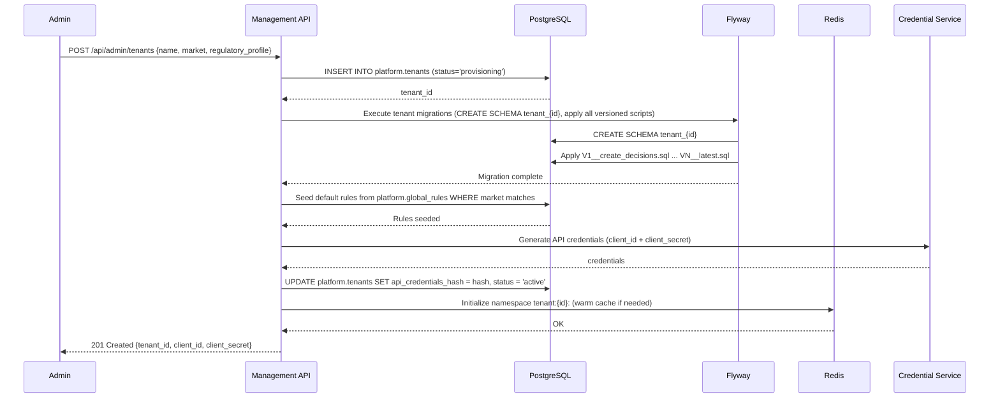
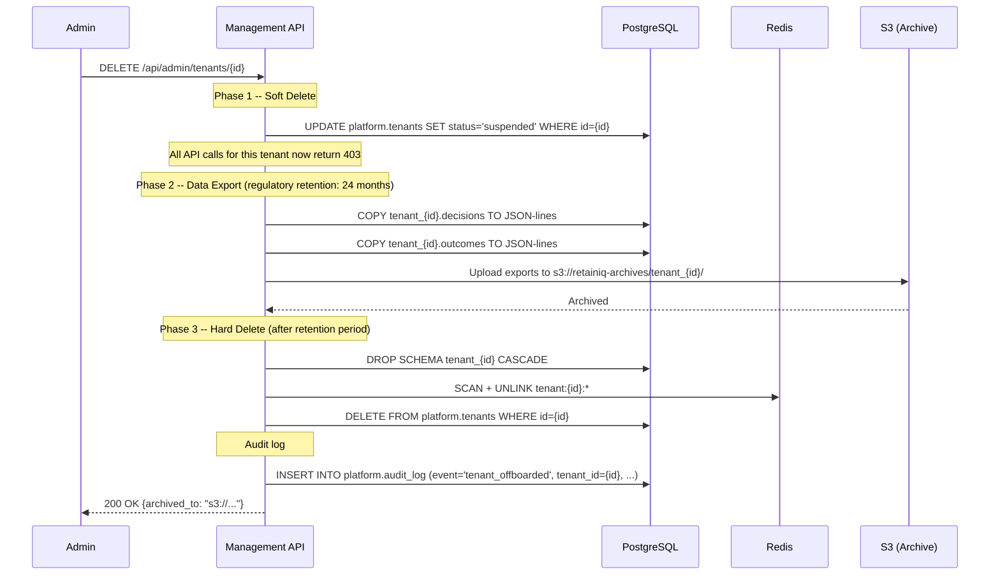

# Multi-Tenancy Schema Design

> Each tenant represents a telecom operator's CVM instance — fully isolated schema, independent rules, separate ranking weights. This ensures that each operator's CVM strategy, compliance requirements, and subscriber data remain completely separate.

**RetainIQ -- Schema-per-Tenant Isolation on PostgreSQL 15**

| Component        | Technology                     |
|------------------|--------------------------------|
| Database         | PostgreSQL 15 (Amazon RDS)     |
| Cache            | Redis 7 Cluster                |
| Migrations       | Flyway                         |
| Application      | Kotlin / Spring Boot (JVM)     |
| Region           | AWS me-south-1 (Bahrain)       |

---

## 1. Isolation Strategy

RetainIQ uses **schema-per-tenant** isolation within a single shared PostgreSQL database. Each tenant gets its own schema (`tenant_{id}`) while shared platform metadata lives in the `platform` schema.

### Why not database-per-tenant?

- **Operational cost at scale.** Each database requires its own RDS instance or cluster, multiplying infrastructure spend linearly with tenant count.
- **Connection pooling complexity.** Each database needs its own connection pool. With 20+ tenants, connection management becomes a significant operational burden and wastes resources on idle connections.
- **Cross-tenant analytics.** Aggregated reporting across tenants (e.g., platform-wide churn metrics for BNG leadership) requires cross-database queries or ETL pipelines.

### Why not shared-schema with RLS only?

- **Regulatory risk for MENA telcos.** Telecommunications regulators in the GCC (TRA, CITC, TDRA) may require demonstrable data separation. Schema isolation provides a clear, auditable boundary that RLS alone does not.
- **Harder audit separation.** Schema-level isolation makes it straightforward to prove that Tenant A's data is physically separated from Tenant B's in `pg_catalog` queries, schema-level backups, and access grants.
- **Blast radius.** A misconfigured RLS policy silently leaks data. A missing `SET search_path` fails loudly (table not found).

### Defense-in-depth

RetainIQ applies three layers of tenant isolation:

1. **Schema isolation** -- each tenant's tables exist in a dedicated PostgreSQL schema.
2. **Row-Level Security (secondary guard)** -- RLS policies on critical tables act as a safety net in case application code bypasses the schema path.
3. **Application-level tenant context** -- the tenant identifier is extracted from the JWT `tenant_id` claim at the API gateway and propagated through the request lifecycle. No request is processed without a validated tenant context.

---

## 2. Schema Layout

### 2.1 Shared `platform` Schema

```sql
CREATE SCHEMA platform;

-- Tenant registry
CREATE TABLE platform.tenants (
    id                   UUID PRIMARY KEY DEFAULT gen_random_uuid(),
    name                 TEXT NOT NULL,
    market               TEXT NOT NULL,            -- e.g. 'BH', 'SA', 'AE'
    regulatory_profile   JSONB NOT NULL DEFAULT '{}',
    catalog_webhook_url  TEXT,
    api_credentials_hash TEXT NOT NULL,
    status               TEXT NOT NULL DEFAULT 'provisioning'
                         CHECK (status IN ('active', 'suspended', 'provisioning')),
    created_at           TIMESTAMPTZ NOT NULL DEFAULT now(),
    updated_at           TIMESTAMPTZ NOT NULL DEFAULT now()
);

CREATE INDEX idx_tenants_status ON platform.tenants (status);
CREATE INDEX idx_tenants_market ON platform.tenants (market);

-- Global rules (templates seeded into new tenants)
CREATE TABLE platform.global_rules (
    id              UUID PRIMARY KEY DEFAULT gen_random_uuid(),
    expression_json JSONB NOT NULL,
    markets         TEXT[] NOT NULL DEFAULT '{}',
    version         INT NOT NULL DEFAULT 1,
    active          BOOLEAN NOT NULL DEFAULT true,
    created_at      TIMESTAMPTZ NOT NULL DEFAULT now()
);
```

### 2.2 Tenant Schema Template (`tenant_{id}`)

The following DDL is applied as a Flyway migration to each new tenant schema. `{id}` is the tenant UUID (hyphens removed).

```sql
CREATE SCHEMA tenant_{id};

-- Decisions: append-only, partitioned by month
CREATE TABLE tenant_{id}.decisions (
    id              UUID PRIMARY KEY DEFAULT gen_random_uuid(),
    subscriber_hash TEXT NOT NULL,
    channel         TEXT NOT NULL,
    signal_vector   JSONB NOT NULL,
    offers_ranked   JSONB NOT NULL,
    rules_applied   TEXT[] NOT NULL DEFAULT '{}',
    degraded        BOOLEAN NOT NULL DEFAULT false,
    confidence      REAL,
    created_at      TIMESTAMPTZ NOT NULL DEFAULT now()
) PARTITION BY RANGE (created_at);

-- Create initial partitions (current month + next month)
-- Additional partitions are created by a scheduled job.
CREATE TABLE tenant_{id}.decisions_y2026m04
    PARTITION OF tenant_{id}.decisions
    FOR VALUES FROM ('2026-04-01') TO ('2026-05-01');

CREATE TABLE tenant_{id}.decisions_y2026m05
    PARTITION OF tenant_{id}.decisions
    FOR VALUES FROM ('2026-05-01') TO ('2026-06-01');

CREATE INDEX idx_decisions_subscriber ON tenant_{id}.decisions (subscriber_hash, created_at DESC);
CREATE INDEX idx_decisions_channel    ON tenant_{id}.decisions (channel, created_at DESC);

-- Outcomes
CREATE TABLE tenant_{id}.outcomes (
    id              UUID PRIMARY KEY DEFAULT gen_random_uuid(),
    decision_id     UUID NOT NULL REFERENCES tenant_{id}.decisions (id),
    offer_sku       TEXT NOT NULL,
    outcome         TEXT NOT NULL CHECK (outcome IN ('accepted', 'rejected', 'ignored', 'expired')),
    revenue_delta   NUMERIC(12, 2),
    churn_prevented BOOLEAN,
    created_at      TIMESTAMPTZ NOT NULL DEFAULT now()
);

CREATE INDEX idx_outcomes_decision ON tenant_{id}.outcomes (decision_id);
CREATE INDEX idx_outcomes_sku      ON tenant_{id}.outcomes (offer_sku, created_at DESC);

-- VAS Product catalog
CREATE TABLE tenant_{id}.vas_products (
    sku               TEXT PRIMARY KEY,
    name              TEXT NOT NULL,
    name_ar           TEXT,
    category          TEXT NOT NULL,
    margin            NUMERIC(8, 2) NOT NULL,
    eligibility_rules JSONB NOT NULL DEFAULT '{}',
    markets           TEXT[] NOT NULL DEFAULT '{}',
    bundle_with       TEXT[] NOT NULL DEFAULT '{}',
    incompatible_with TEXT[] NOT NULL DEFAULT '{}',
    upgrade_from      TEXT[] NOT NULL DEFAULT '{}',
    regulatory        JSONB NOT NULL DEFAULT '{}',
    active            BOOLEAN NOT NULL DEFAULT true,
    updated_at        TIMESTAMPTZ NOT NULL DEFAULT now()
);

-- Tenant-specific rules
CREATE TABLE tenant_{id}.rules (
    id              UUID PRIMARY KEY DEFAULT gen_random_uuid(),
    type            TEXT NOT NULL,
    expression_json JSONB NOT NULL,
    market          TEXT,
    version         INT NOT NULL DEFAULT 1,
    active          BOOLEAN NOT NULL DEFAULT true,
    created_at      TIMESTAMPTZ NOT NULL DEFAULT now(),
    updated_at      TIMESTAMPTZ NOT NULL DEFAULT now()
);

CREATE INDEX idx_rules_active ON tenant_{id}.rules (active, type);

-- A/B Tests
CREATE TABLE tenant_{id}.ab_tests (
    id             UUID PRIMARY KEY DEFAULT gen_random_uuid(),
    name           TEXT NOT NULL,
    variants       JSONB NOT NULL,
    allocation     JSONB NOT NULL,
    start_date     DATE NOT NULL,
    end_date       DATE,
    primary_metric TEXT NOT NULL,
    status         TEXT NOT NULL DEFAULT 'draft'
                   CHECK (status IN ('draft', 'running', 'paused', 'completed')),
    created_at     TIMESTAMPTZ NOT NULL DEFAULT now()
);
```

### 2.3 RLS Secondary Guard (applied per tenant schema)

```sql
-- Example: RLS on decisions as a defense-in-depth measure.
-- The application sets a session variable with the tenant ID.
ALTER TABLE tenant_{id}.decisions ENABLE ROW LEVEL SECURITY;

CREATE POLICY tenant_isolation ON tenant_{id}.decisions
    USING (current_setting('app.current_tenant', true) = '{id}');
```

---

## 3. Tenant Provisioning Flow



### Provisioning guarantees

- The entire flow runs within a distributed saga. If any step fails, previous steps are compensated (schema dropped, tenant row deleted).
- Flyway migrations are idempotent -- re-running provisioning for a failed tenant is safe.
- Credentials are returned exactly once. The `client_secret` is never stored in plaintext; only a bcrypt hash is persisted.

---

## 4. Migration Strategy

### Directory structure

```
db/
  migration/
    platform/                          # Shared schema migrations
      V1__create_tenants_table.sql
      V2__create_global_rules.sql
      V3__add_tenant_market_index.sql
    tenant/                            # Template migrations (applied per tenant)
      V1__create_decisions_table.sql
      V2__create_outcomes_table.sql
      V3__create_vas_products_table.sql
      V4__create_rules_table.sql
      V5__create_ab_tests_table.sql
      V6__add_decisions_confidence.sql
```

### Execution model

| Trigger | Scope | Behavior |
|---------|-------|----------|
| Platform migration | `platform` schema only | Flyway runs against `platform` with `flyway.schemas=platform`. Standard single-schema migration. |
| Tenant migration | All active tenant schemas | Application queries `platform.tenants WHERE status = 'active'`, then iterates each tenant, running Flyway against `tenant_{id}`. |

### Failure handling

- **Tenant migration failures are isolated.** If migration fails for `tenant_abc`, it is logged and retried on the next deployment. Other tenants proceed independently.
- **Retry mechanism.** A scheduled job (`TenantMigrationRetryTask`) runs every 15 minutes, checking for tenants whose Flyway `schema_version` is behind the latest version, and retries pending migrations.
- **Schema version tracking.** Flyway's `flyway_schema_history` table exists in each schema independently. This allows per-tenant migration state inspection.

### Kotlin migration runner (simplified)

```kotlin
@Component
class TenantMigrationRunner(
    private val dataSource: DataSource,
    private val tenantRepository: TenantRepository
) {
    fun migrateAllTenants() {
        val tenants = tenantRepository.findAllActive()
        tenants.forEach { tenant ->
            try {
                Flyway.configure()
                    .dataSource(dataSource)
                    .schemas("tenant_${tenant.id.toCompactString()}")
                    .locations("classpath:db/migration/tenant")
                    .load()
                    .migrate()
                log.info("Migration complete for tenant ${tenant.id}")
            } catch (e: Exception) {
                log.error("Migration failed for tenant ${tenant.id}", e)
                // Logged, not rethrown -- other tenants continue
            }
        }
    }
}
```

---

## 5. Connection Management

### HikariCP configuration

```yaml
spring:
  datasource:
    hikari:
      maximum-pool-size: 20        # Per pod
      minimum-idle: 5
      connection-timeout: 3000     # 3 seconds
      idle-timeout: 600000         # 10 minutes
      max-lifetime: 1800000        # 30 minutes
      leak-detection-threshold: 30000
```

### Schema switching

A shared connection pool is used. Schema isolation is achieved by setting `search_path` per request:

```kotlin
@Component
class TenantSchemaInterceptor(
    private val dataSource: DataSource
) : HandlerInterceptor {

    override fun preHandle(request: HttpServletRequest, response: HttpServletResponse, handler: Any): Boolean {
        val tenantId = request.getAttribute("tenantId") as? String
            ?: throw TenantNotFoundException("No tenant context")

        // Store in ThreadLocal for downstream use
        TenantContext.set(tenantId)

        // Set search_path for this request's database session
        dataSource.connection.use { conn ->
            conn.createStatement().execute(
                "SET search_path = tenant_$tenantId, public"
            )
        }
        return true
    }

    override fun afterCompletion(
        request: HttpServletRequest,
        response: HttpServletResponse,
        handler: Any,
        ex: Exception?
    ) {
        TenantContext.clear()
    }
}
```

### Connection math

| Scenario | Pods | Connections/pod | Total connections |
|----------|------|-----------------|-------------------|
| Minimum  | 3    | 20              | 60                |
| Typical  | 8    | 20              | 160               |
| Peak     | 20   | 20              | 400               |

RDS `db.r6g.xlarge` supports up to 2,000 connections. The maximum of 400 application connections leaves ample headroom for admin connections, monitoring, and migration runners.

---

## 6. Redis Namespace Design

### Key pattern

```
tenant:{tenant_id}:{entity}:{key}
```

### Examples

| Key | Purpose |
|-----|---------|
| `tenant:abc123:subscriber:hash_xyz` | Cached subscriber profile and signals |
| `tenant:abc123:catalog:sku_123` | Cached VAS product details |
| `tenant:abc123:usage:hash_xyz` | Recent usage data for a subscriber |
| `tenant:abc123:rules:v3` | Compiled rule set (version 3) |
| `tenant:abc123:decision:req_456` | Cached recent decision (dedup) |

### TTL policy

| Entity     | TTL    | Rationale |
|------------|--------|-----------|
| subscriber | 5 min  | Profile changes infrequently but signals drift; short TTL balances freshness vs load |
| catalog    | 15 min | Product catalog updates are infrequent, pushed via webhook invalidation |
| usage      | 1 min  | Usage data is near-real-time; stale usage leads to bad offers |
| rules      | 1 h    | Rules change only via admin API; cache is invalidated on update |

### Isolation model

- **Logical isolation via key prefix**, not separate Redis instances or databases.
- Cost-efficient: a single Redis 7 cluster serves all tenants.
- Tenant key purge on offboarding: `SCAN` with pattern `tenant:{id}:*` and `UNLINK` in batches.

---

## 7. Tenant Offboarding



### Retention rules

- **MENA regulatory requirement:** decision and outcome data must be retained for a minimum of 24 months after the last decision date.
- Archived data is stored in S3 with server-side encryption (SSE-KMS) and a lifecycle policy that transitions to Glacier after 6 months.
- Hard delete is triggered by a scheduled job that checks `suspended` tenants whose last decision is older than 24 months.

---

## 8. Cost Model

### Per-tenant overhead

| Resource | Per-tenant cost | Notes |
|----------|----------------|-------|
| Schema metadata | Negligible (~KB) | PostgreSQL catalog entries |
| Flyway tracking | Negligible | One `flyway_schema_history` table per schema |
| Redis namespace | $0 marginal | Logical prefix, no dedicated resources |
| Base infra share | ~$15-30/month | Proportional share of RDS, Redis, compute |

### Decision storage estimate

| Metric | Value |
|--------|-------|
| Average decision row size | ~500 bytes |
| Daily decisions (mid-size telco) | 500,000 |
| Monthly storage per tenant | ~7.5 GB uncompressed |
| With PostgreSQL TOAST + compression | ~3-4 GB |
| Monthly RDS storage cost (gp3) | ~$0.40/GB = ~$1.50-3.00/month |

### Schema-per-tenant vs database-per-tenant breakeven

| Tenants | Schema-per-tenant (shared RDS) | Database-per-tenant (separate RDS) |
|---------|-------------------------------|-----------------------------------|
| 5       | ~$800/month (single db.r6g.xlarge) | ~$4,000/month (5x db.r6g.large) |
| 20      | ~$800/month | ~$12,000/month |
| 50      | ~$1,600/month (upgrade to 2xlarge) | ~$25,000/month |

Schema-per-tenant remains cost-effective up to approximately **50 tenants**. Beyond that, evaluate horizontal sharding (tenant groups across multiple databases) rather than switching to database-per-tenant.

---

## 9. Operational Concerns

### Monitoring

| Metric | Source | Alert threshold |
|--------|--------|----------------|
| Per-tenant query latency (p99) | pg_stat_statements + tenant label | > 200ms |
| Schema size (bytes) | `pg_total_relation_size` per schema | > 50 GB (investigate partition pruning) |
| Migration status | Flyway schema_version delta | Any tenant behind by > 1 version for > 1 hour |
| Connection pool utilization | HikariCP metrics | > 80% for > 5 minutes |
| Redis memory per tenant | Key-prefix memory profiling | > 500 MB (review TTLs) |

### Noisy neighbor mitigation

- **API gateway rate limits** are configured per tenant via the `platform.tenants.regulatory_profile` field. Default: 1,000 requests/second per tenant.
- **Per-tenant connection limits** are enforced at the application level. No single tenant can consume more than 25% of the pool.
- **Query timeouts** are set at 5 seconds via `statement_timeout` in the tenant schema's default session settings:

```sql
ALTER ROLE retainiq_app IN DATABASE retainiq SET statement_timeout = '5s';
```

- **Partition management** prevents large tenants from degrading scan performance. Monthly partitions on `decisions` ensure that queries against recent data touch only the relevant partition.

### Backup and recovery

- **Backup strategy:** single RDS automated backup captures all tenant schemas. Daily snapshots with 7-day retention. Point-in-time recovery (PITR) is available with 5-minute granularity.
- **Trade-off accepted:** PITR restores the entire database, not individual tenants. Single-tenant recovery requires restoring to a temporary instance and extracting the relevant schema via `pg_dump -n tenant_{id}`.
- **WAL archiving** to S3 for cross-region disaster recovery (me-south-1 to eu-west-1).

### Schema maintenance

A scheduled weekly job runs:

```sql
-- Per tenant schema, executed by maintenance job
ANALYZE tenant_{id}.decisions;
ANALYZE tenant_{id}.outcomes;

-- Create next month's partition if it does not exist
-- (managed by PartitionMaintenanceTask.kt)
```

---

## Appendix: Tenant Context Propagation

```
                    JWT with tenant_id claim
                           |
                           v
                    +------+------+
                    | API Gateway |  <-- validates JWT, extracts tenant_id
                    +------+------+
                           |
                           v
                  +--------+--------+
                  | Spring Filter   |  <-- TenantContextFilter sets ThreadLocal
                  +--------+--------+
                           |
                           v
                  +--------+--------+
                  | Schema Interceptor | <-- SET search_path = tenant_{id}
                  +--------+--------+
                           |
                           v
                  +--------+--------+
                  | Service Layer   |  <-- business logic, unaware of tenancy
                  +--------+--------+
                           |
                    +------+------+
                    | Repository  |  <-- queries execute against tenant schema
                    +------+------+
                           |
                    +------+------+
                    | PostgreSQL  |  <-- search_path resolves tables
                    +-------------+
```

The tenant context is set once at the edge and propagated implicitly. Service and repository layers are tenant-unaware, operating against whichever schema is in the `search_path`.
