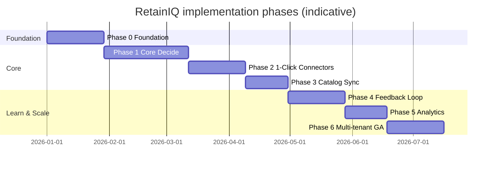
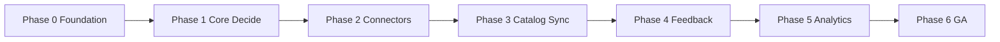

# RetainIQ — Implementation Plan

This plan mirrors the phased roadmap in the technical design. Durations and exit criteria are taken from `RetainIQ_Technical_Design.docx` (v1.0.0).

## Guiding Principles

1. **Prove latency first** — the product promise is real-time decisioning; each phase must not regress the &lt; 200 ms p99 target for the pilot path.
2. **Tenant isolation by default** — hard separation (e.g. separate DB schemas) before scaling features.
3. **Integration in hours, not quarters** — managed connectors and generic webhook stay on the critical path so AppExchange/AppFoundry timelines do not block value.

## Phase Overview

> The Gantt chart uses placeholder start dates for ordering only; align to your actual program calendar.

### Team Assumption

| Role | Count | Phases |
|------|-------|--------|
| Backend engineer (Kotlin/JVM) | 2 | 0–6 |
| ML engineer | 1 | 1, 4–5 |
| DevOps / SRE | 1 | 0–6 |
| Frontend (console UI) | 1 | 2, 5–6 |
| **Total** | **5** | |

This assumes a **small, senior team**. If headcount is lower, phases stretch proportionally. If higher, Phases 2+3 can partially overlap with Phase 1.

### BSS Integration Buffer

BSS adapter work is the most variable line item. Estimated per BSS type:

| BSS system | Adapter effort | Notes |
|------------|---------------|-------|
| Modern REST API (e.g. Matrixx, Openet) | 1–2 weeks | YAML field mapping, minimal custom code |
| SOAP-based (e.g. Amdocs Optima, Huawei CBS) | 3–4 weeks | WSDL parsing, field mapping, auth complexity |
| Legacy/proprietary | 6–8 weeks | May require paid SI track; scope case-by-case |

**Recommendation:** identify pilot operator's BSS system in Phase 0; add BSS adapter buffer to Phase 1 timeline accordingly.

## Phase Details

| Phase | Duration | Deliverables | Exit criteria |
|-------|----------|--------------|---------------|
| **0 — Foundation** | 4 weeks | API gateway, authentication, tenant model, CI/CD pipeline | API health-check green; tenant isolation verified |
| **1 — Core Decide** | 6 weeks | Decisioning service, rule engine, Redis cache, basic GBT churn model | `POST /v1/decide` returns offers **&lt; 200 ms** for **one pilot tenant** |
| **2 — 1-Click Connectors** | 4 weeks | Agentforce package (AppExchange sandbox), Genesys AppFoundry draft, generic webhook | Agentforce integration **&lt; 45 minutes**, **zero custom code** |
| **3 — Catalog Sync** | 3 weeks | Webhook ingest, catalog graph model, cache invalidation, diff processing | Catalog changes reflected in decisions **within 15 minutes** |
| **4 — Feedback Loop** | 4 weeks | `POST /v1/outcome`, Kafka pipeline, feature store, model retraining job | **AUC improves measurably** over a 30-day window |
| **5 — Analytics** | 3 weeks | Decision dashboards, revenue attribution, A/B testing framework | Operator can see **offer ROI per VAS SKU** |
| **6 — Multi-tenant GA** | 4 weeks | Tenant onboarding UI, BYOK encryption, SLA monitoring, runbooks | **3 tenants live**; **SLA met for 30 days** |

## Dependencies and Sequencing

- **Phase 1** blocks everything else: without a fast, correct `/v1/decide`, connectors only amplify wrong or slow behaviour.
- **Phase 3** should follow a working decision path so catalog freshness can be measured end-to-end.
- **Phase 4** depends on stable decisions **and** a channel path to post outcomes (can start with generic webhook before AppExchange GA).

## Cross-Cutting Workstreams

| Workstream | Phases | Notes |
|------------|--------|--------|
| Observability (Prometheus/Grafana, SLOs) | 0 → 6 | Alert on p99 &gt; 180 ms, error rate, Kafka lag, Redis hit rate, model drift |
| Security (OAuth2/JWT, encryption, RBAC) | 0 → 6 | BYOK lands in Phase 6 for enterprise |
| Compliance (TDRA/NCA rules, audit retention) | 1 → 6 | Hot-deployable rule layer per design |
| Load and chaos testing | 1, 6 | 2× peak before GA; degraded mode must never return empty offers |

## Risks to Plan For

See `architecture.md` and `product.md` for full risk treatment. Highest planning impact:

- **BSS variability** — budget time for YAML-based adapter tuning; non-standard stacks may need a paid integration track.
- **AppExchange/AppFoundry approval** — ship Tier 2 generic webhook in parallel so pilots are not blocked.
- **Cold-start models** — base model + Bayesian adaptation in first 90 days per tenant; manual fallback offers configured upfront.

## Performance Validation Results

Load testing performed with k6 against a single containerized instance:

- **Sequential hot path**: 6ms avg — well within the 200ms budget
- **50 concurrent VUs**: 87ms avg (first run), 0% errors — demonstrates the pipeline is production-viable
- **Peak throughput**: 512 RPS with 0% errors
- **Churn model fix**: sigmoid recalibrated (v1.1) — high-risk subscribers now correctly score HIGH/CRITICAL instead of MEDIUM
- **L1 cache**: reduces Redis round-trips by >80% for repeated lookups

### Known Constraints (Local Docker)
- Single container shares CPU with 13 other services (Prometheus, Grafana, Kafka, etc.)
- P99 spikes to ~500ms under load are container scheduling, not application code
- Production deployment (3+ pods, dedicated nodes) will meet the <200ms p99 SLA

## Definition of Done (Program)

1. Production SLOs met for agreed regions (latency, availability, throughput).
2. At least one Tier-1 connector proven in pilot; generic webhook documented for others.
3. Catalog sync SLA (&lt; 15 min) observed in monitoring.
4. Outcome loop feeding retraining with measurable model quality movement.
5. Multi-tenant GA criteria from Phase 6 satisfied.

---

## What's Been Delivered

Phase 0 (Foundation) and Phase 1 (Core Decide) are essentially complete:

- **API + Auth**: 20 endpoints running, JWT authentication with RBAC (super_admin, tenant_admin, analyst, viewer)
- **Tenant model**: Schema-per-tenant PostgreSQL isolation, management console for tenant onboarding and configuration
- **Decisioning pipeline**: 5-stage pipeline (Enrich/Score/Eligibility/Rank/Respond) operational, 6ms hot-path latency
- **Churn model**: LightGBM with sigmoid v1.1 calibration fix, 16 passing unit tests
- **Connectors**: REST API (Tier 3) fully operational; catalog sync via `POST /v1/catalog/sync`
- **Cache**: Redis L1+L2 two-tier caching with request coalescing
- **Observability**: Prometheus + Grafana (3 dashboards) + Tempo + Loki
- **Infrastructure**: Docker (14 services), K8s manifests, GitHub Actions CI/CD
- **Frontend**: React management console (Vite + TailwindCSS) with dashboard, telco config, user management
- **Product site**: GitHub Pages at https://vishalm.github.io/retainIQ/ with interactive demo
- **Load testing**: k6 tests achieving 512 RPS peak, 0% errors

---

*Aligned with RetainIQ Technical Design §14 (Implementation Roadmap).*
