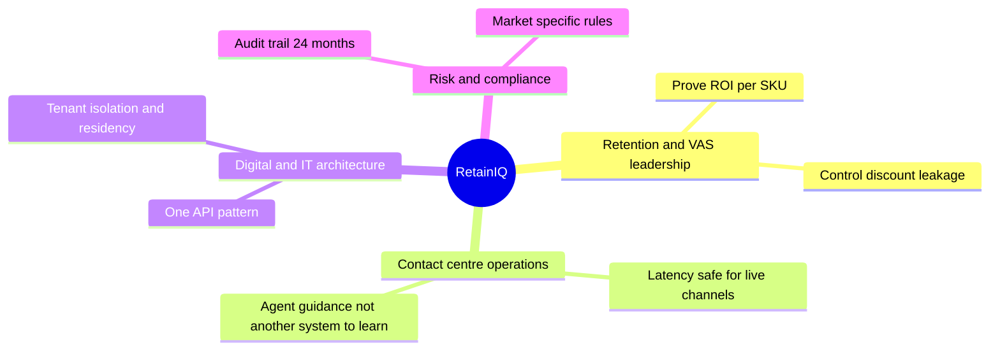
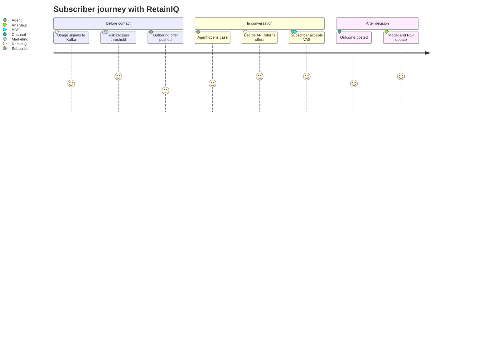

# RetainIQ — Product

This document describes RetainIQ from a **product** perspective: who it serves, what outcomes we promise, how we win, and how we measure success. It complements the technical design and implementation plan; it does not replace API or architecture specifications.

---

## 1. Vision

**RetainIQ is the real-time execution layer for Customer Value Management (CVM) at telecom operators.** It bridges the gap between CVM strategy and frontline execution. In the moment a subscriber shows intent to leave — or before they even contact the carrier — RetainIQ scores risk, applies your eligibility rules, selects compliant VAS offers that balance **retention probability** and **margin**, and returns a ranked list fast enough for live voice and chat. Your CVM team owns the strategy. Channels own the conversation. BSS owns billing. RetainIQ owns **which offer to show and why — in real time**.

---

## 2. Problem we solve

| Pain | Today | With RetainIQ |
|------|--------|----------------|
| Slow or inconsistent offers | Agents improvise or read static scripts | Every turn can call one API for ranked, scripted offers |
| Margin blind spots | “Save the customer” at any cost | Explicit trade-off: retention × margin, with caps |
| Integration tax | Months of SI for each channel | Managed connectors and webhooks: **hours**, not quarters |
| Compliance exposure | Rules buried in code or spreadsheets | Versioned, hot-deployed rules per market (TDRA, NCA, …) |
| No closed loop | Wins and losses disappear into CRM noise | Decisions and outcomes feed attribution and model improvement |

---

## 3. Who we serve (personas)

### 3.1 Primary buyers and users

- **Economic buyer:** VP of CVM / Head of Retention / VAS / Customer Value Management—cares about **saved revenue**, **margin**, **CVM campaign effectiveness**, and **time-to-market** for new bundles. This is a CVM budget-line purchase.
- **Champion:** Contact centre transformation or CRM owner—cares about **agent experience** and **Salesforce/Genesys roadmap alignment**.
- **Day-to-day users:** Supervisors and analysts tuning rules and reading dashboards; **agents** consume offers inside existing desktops (not a separate RetainIQ UI for every action).
- **Day-2 power user:** The **retention analyst** who tunes ranking weights, writes eligibility rules in the JSON DSL, and monitors A/B test results. This person becomes the stickiest user — once they've encoded operator-specific logic into RetainIQ's rule engine, switching cost is high.

---

## 4. Product promise (non-negotiables)

1. **Speed:** Real-time path targets **under 200 ms p99** end-to-end so IVR and chat turns are not blocked.
2. **One decision API:** `POST /v1/decide` is the contract; optional signals enrich scoring but are not required to “bootstrap” the product.
3. **Honest scope:** We are **not** the chatbot and **not** the BSS—we integrate with both.
4. **Always something useful:** Degraded mode still returns **safe, generic offers** with clear confidence flags—never a silent failure for the agent.

---

## 5. Value proposition canvas (summary)

<svg xmlns="http://www.w3.org/2000/svg" viewBox="0 0 640 320" width="100%" role="img" aria-label="Value map: pains relieved and gains created">
  <rect width="640" height="320" fill="#fafafa" stroke="#e5e5e5" rx="6"/>
  <text x="320" y="28" text-anchor="middle" fill="#171717" font-family="Georgia,serif" font-size="16" font-weight="700">RetainIQ value map</text>
  <rect x="24" y="48" width="280" height="120" fill="#fff" stroke="#d4d4d4" rx="4"/>
  <text x="164" y="72" text-anchor="middle" fill="#525252" font-family="system-ui,sans-serif" font-size="12" font-weight="600">Pains relieved</text>
  <text x="36" y="98" fill="#404040" font-family="system-ui,sans-serif" font-size="11">Integration drag and SI cost</text>
  <text x="36" y="118" fill="#404040" font-family="system-ui,sans-serif" font-size="11">Offers that ignore margin or policy</text>
  <text x="36" y="138" fill="#404040" font-family="system-ui,sans-serif" font-size="11">No audit trail for regulators or finance</text>
  <rect x="24" y="184" width="280" height="112" fill="#fff" stroke="#d4d4d4" rx="4"/>
  <text x="164" y="208" text-anchor="middle" fill="#525252" font-family="system-ui,sans-serif" font-size="12" font-weight="600">Gains created</text>
  <text x="36" y="234" fill="#404040" font-family="system-ui,sans-serif" font-size="11">Faster time-to-live on Agentforce and Genesys</text>
  <text x="36" y="254" fill="#404040" font-family="system-ui,sans-serif" font-size="11">Ranked offers with scripts and deep links</text>
  <text x="36" y="274" fill="#404040" font-family="system-ui,sans-serif" font-size="11">Outcome loop improves models and proves ROI</text>
  <rect x="336" y="48" width="280" height="248" fill="#f5f5f5" stroke="#a3a3a3" rx="4"/>
  <text x="476" y="80" text-anchor="middle" fill="#171717" font-family="system-ui,sans-serif" font-size="13" font-weight="600">RetainIQ deliverables</text>
  <line x1="356" y1="100" x2="596" y2="100" stroke="#d4d4d4"/>
  <text x="356" y="124" fill="#262626" font-family="system-ui,sans-serif" font-size="11">Managed connectors and webhook tier</text>
  <text x="356" y="148" fill="#262626" font-family="system-ui,sans-serif" font-size="11">VAS catalog graph and eligibility engine</text>
  <text x="356" y="172" fill="#262626" font-family="system-ui,sans-serif" font-size="11">Churn model with tenant adaptation</text>
  <text x="356" y="196" fill="#262626" font-family="system-ui,sans-serif" font-size="11">Multi-objective ranking and A/B tests</text>
  <text x="356" y="220" fill="#262626" font-family="system-ui,sans-serif" font-size="11">Decision and outcome analytics</text>
  <text x="356" y="244" fill="#262626" font-family="system-ui,sans-serif" font-size="11">Residency-ready deployment options</text>
  <path d="M 304 108 C 320 108 320 140 336 140" fill="none" stroke="#737373" stroke-width="1.5"/>
  <path d="M 304 240 C 320 240 320 176 336 176" fill="none" stroke="#737373" stroke-width="1.5"/>
</svg>

---

## 5b. VAS Catalog Graph — the deepest moat

The VAS catalog is not a flat product list. RetainIQ models it as a **directed graph** where products are nodes and edges encode:

- **Incompatibility** — product A cannot coexist with product B (e.g. two competing streaming bundles)
- **Upgrade-from** — product B is a natural upgrade path from product A (e.g. 5GB → 20GB data add-on)
- **Bundle-with** — product A sells better when paired with product C (e.g. roaming + travel insurance)

This graph powers **intelligent offer candidacy**: the ranker doesn't just score individual products, it scores **offer combinations** that respect constraints. Competitors using flat eligibility lists can't do this without rebuilding their catalog model.

Per-market regulatory metadata (consent flags, disclosure text, cooling-off periods) is attached to graph nodes, so compliance is structural — not a filter bolted on after ranking.

The graph is synced from the operator's VAS platform via `POST /v1/catalog/sync` (HMAC-signed webhook, freshness target < 15 minutes). Operators who invest in enriching their catalog graph get compounding returns: better offers, fewer compliance gaps, and higher attach rates.

---

## 6. Differentiators (why us, why now)

| Theme | What we claim | Proof we must show |
|--------|----------------|---------------------|
| **Time-to-value** | Under one hour on Tier-1 connectors | Recorded install + live decide on sandbox |
| **Economics** | Margin enters the objective function | Dashboards: revenue and margin by SKU |
| **Compliance** | Rules are first-class and market-aware | Rule change without redeploy; audit export |
| **Operational fit** | Stateless API scales with contact volume | Load tests and SLO dashboards |

---

## 7. Product journey (reactive and proactive)

**Reactive:** channel calls `/v1/decide` during the conversation.

**Proactive:** usage events drive a **pre-contact** path (design target: trigger roughly **24–72 hours** before predicted churn when risk exceeds threshold).

---

## 8. Success metrics (product KPIs)

These map to engineering SLOs but are expressed in **business** terms:

| Metric | Definition | Direction |
|--------|------------|-----------|
| **Decision latency p99** | End-to-end for `/v1/decide` | Stay under 200 ms |
| **Offer attach rate** | Accepted offers / decisions where offers shown | Up |
| **Revenue saved** | Attributed revenue from accepted offers | Up |
| **Margin after retention** | Net margin on saved accounts vs baseline | Up or neutral |
| **Time-to-live** | Calendar days from contract to first production decision | Down |
| **Rule change lead time** | Hours from policy update to production | Down |

---

## 9. Roadmap narrative (customer-facing)

| Phase | Customer-visible outcome |
|-------|---------------------------|
| Foundation | Secure tenant-ready platform; operators trust isolation |
| Core Decide | First production “decide” moments on pilot traffic |
| Connectors | Agentforce and Genesys paths without custom integration projects |
| Catalog sync | Offers always reflect latest VAS within minutes |
| Feedback loop | Models improve from real accept/decline behaviour |
| Analytics | Leadership sees ROI and experiment results per SKU |
| Multi-tenant GA | Repeatable onboarding, BYOK, SLA-backed operations |

Detailed durations and exit criteria live in [plan.md](plan.md).

---

## 10. Pricing and packaging (hypothesis)

Not fixed in the technical design; typical axes for enterprise telecom SaaS:

- **By committed API volume** (decisions per month) with burst allowance.
- **By channel connectors** (Tier 1 vs webhook-only).
- **By region** (residency and compliance workload).
- **Professional services** only for **non-standard BSS** adapters (aligns with risk mitigation in the design).

---

## 11. Risks (product view)

| Risk | Product response |
|------|------------------|
| BSS heterogeneity | Sell **adapter configurability**; scope SI for exceptions |
| Model cold start | Communicate **90-day adaptation**; show fallback offers quality |
| Store approval delays | Lead with **webhook tier**; position AppExchange as accelerator |
| Regulatory change | Market **rule ownership** in the operator workflow |
| Sovereignty concerns | **In-region** deployment story from first enterprise conversations |

---

## 12. Open product questions

- Which **first channel** wins the category story (Agentforce vs Genesys vs regional CRM)?
- Standard **SKU taxonomy** across markets or fully operator-specific graph?
- **Agent UX** ownership: how much scripting stays in RetainIQ vs CRM templates?

---

## 13. Messaging snapshot

**One-liner:** RetainIQ is the real-time execution layer for CVM — turning your offer strategy and VAS catalog into **ranked, compliant, margin-aware decisions** in under 200ms.

**Elevator (three sentences):** Your CVM team designs brilliant retention offers, but there's no system executing those decisions at the speed of a live conversation. RetainIQ is the stateless decision API that bridges CVM strategy to the frontline — it plugs into Agentforce, Genesys, or your stack, scores churn, applies your rules, and ranks offers in under two hundred milliseconds. Outcomes flow back so your CVM team sees ROI per SKU and models improve with every decision.

**Category:** Customer Value Management (CVM) — Real-Time Decisioning. Also relevant to: CLM (Customer Lifecycle Management), Retention Management, Revenue Assurance, Next-Best-Offer (NBO).

---

*Product narrative derived from RetainIQ Technical Design (v1.0.0, April 2026). For API and deployment detail, see [integration.md](integration.md) and [architecture.md](architecture.md).*
